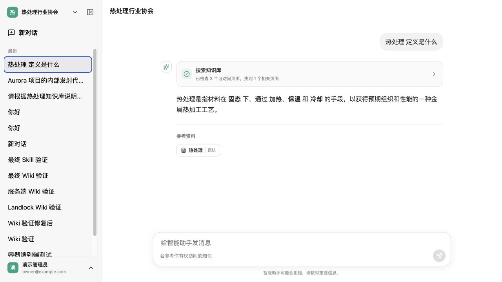

<div align="center">

# Codex Wiki Platform

**面向团队与组织的多租户 AI 知识协作平台**

用自然语言对话、可追踪的 Markdown Wiki、组织级权限和定时网页采集，
把团队知识真正交给智能助手使用。

[](LICENSE)
[](package.json)
[](tsconfig.base.json)
[](https://www.deepseek.com/)

[在线产品展示](https://yixiaoonesmile.github.io/codex-wiki-platform/) ·
[使用指南](docs/usage.md) ·
[部署说明](docs/deployment.md) ·
[架构设计](docs/architecture.md) ·
[安全基线](docs/security.md)

</div>



## 它解决什么问题

Codex Wiki Platform 为不熟悉开发工具的普通用户提供接近 ChatGPT 的克制界面，同时保留
Agent、Skill、组织知识和可审计工具调用能力。平台以官方 Codex `app-server` 作为 Agent
执行内核，通过服务端统一配置的 DeepSeek 模型提供推理能力；知识库采用完整、可阅读、可维护的
Markdown Wiki，而不是向量数据库和不可见的切片召回。

## 核心能力

| 能力 | 当前实现 |
| --- | --- |
| 多租户组织 | 组织隔离、组织显示名称、成员与角色、超级管理员创建组织 |
| Wiki 知识库 | 团队/个人空间、Markdown 页面、文档导入、版本记录、权限过滤 |
| 可解释对话 | 展示 Wiki 搜索过程、命中数量和可点击参考资料 |
| Agent 与 Skill | Codex `app-server` 会话、组织级 Skill、受限工具与审批机制 |
| 定时采集 | 单次、每天、每周、每月、固定间隔，支持自然语言或手动创建 |
| 网页抓取 | 独立 Crawl4AI 服务，保存 Markdown 结果和每次执行记录 |
| 审计与统计 | 模型用量/成本、审计日志、错误日志和基础行为事件 |
| 安全边界 | 服务端密钥、租户范围查询、SSRF 防护、默认关闭 Agent Shell |

## 快速开始

需要 Node.js 22+、Docker Engine / Docker Desktop、Docker Compose，以及官方 `codex` CLI。

```sh
cp .env.example .env
docker compose -f docker-compose.yml -f docker-compose.dev.yml up --build -d
docker compose exec api node packages/database/dist/seed.js
```

访问 `http://localhost:8080`。仅用于本地开发的演示账号：

```text
邮箱：owner@example.com
密码：ChangeMe123!
```

生产环境不要运行演示数据脚本，也不要继续使用任何示例密码。完整配置、Wiki、Skill、定时任务和
服务器部署步骤见 [使用指南](docs/usage.md)。

## 项目结构

```text
apps/web                 React + TypeScript 前端
apps/api                 Fastify API、认证、Agent、Wiki 与任务调度
packages/database        PostgreSQL / Drizzle Schema 与迁移
packages/shared          前后端共享类型
infra/crawl4ai           Crawl4AI 容器运行配置
docs                     使用、架构、安全、部署文档与 GitHub Pages
```

## 当前边界

项目仍处于开发阶段。生产部署前必须完成真实域名 HTTPS、独立密钥、备份恢复、跨租户隔离和真实
DeepSeek 链路验证。`AGENT_SHELL_ENABLED` 默认关闭；只有在部署了独立、按运行隔离的安全执行器后
才应开启。

## 开源许可

原创代码采用 [Apache License 2.0](LICENSE)。项目通过进程协议调用官方 Codex，不复制 Codex
实现；依赖许可和第三方代码边界见 [docs/licensing.md](docs/licensing.md)。
